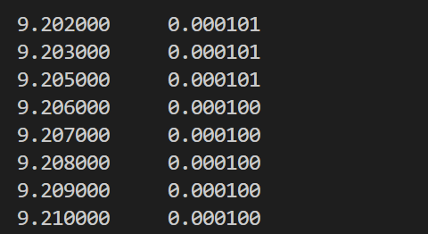
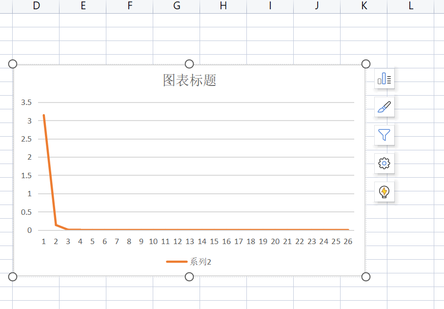
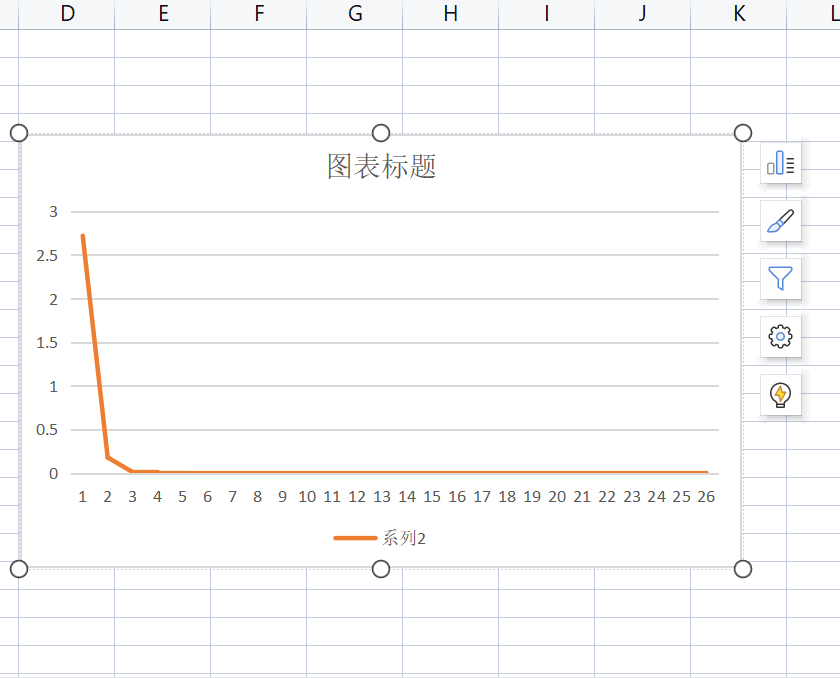
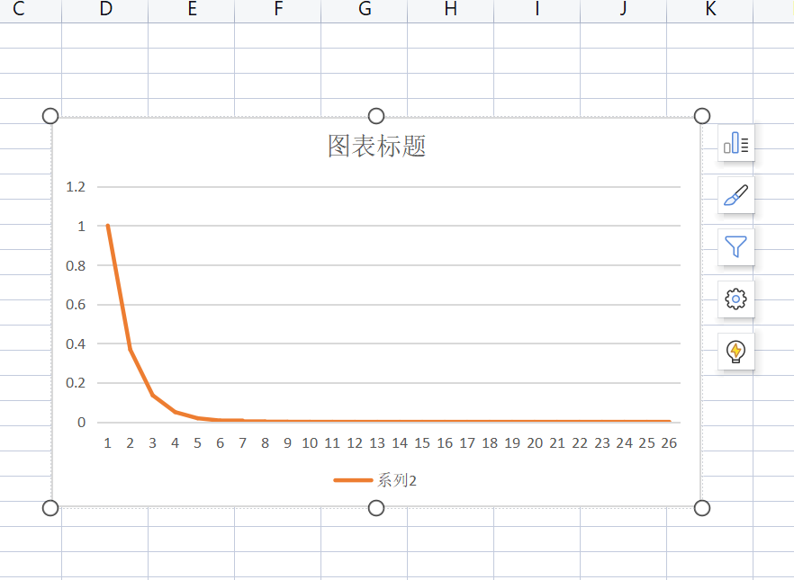

# 任务1实验报告模板

### 题目

&nbsp;&nbsp;&nbsp;&nbsp;运用C语言，使用Euler法、梯形法、改进Euler法、Taylor级数法、Runge-Kutta法、线性多步法等任意一种方法，实现对下述简单微分方程的各个瞬时值与最终定态（收敛值）求解：

&emsp;&emsp;&emsp;&emsp;&emsp;&emsp;&emsp;&emsp;=a\\end{matrix}\\right.)

注：a为常数，可由用户输入确定该值。你可以使用scanf()函数来获取输入的a值。瞬时值求解时步长为0.001，定态误差应小于0.001。

***

### 运行结果截图：

（以下图为例，放入运行结果的截图，结果打印的输出格式可自己设置）

---

### 思考题（请给出思考结论）：

1. 当a为1，给出x在区间[0，25]之间方程的各个瞬时值，该方程的最终定态（收敛值）是多少？

   答：1.000000 0.367879 0.135335 0.049787 0.018316 0.006738 0.002479 0.000912 0.000335 0.000123 0.000045 0.000017 0.000006 0.000002 0.000001 0.000000 0.000000 0.000000 0.000000 0.000000 0.000000 0.000000 0.000000 0.000000 0.000000 0.000000

   最终定态为0

2. 当a为e，给出x在区间[0，25*e]之间方程的各个瞬时值，最终定态（收敛值）是多少？（e为指数）

   答：2.718281 0.179374 0.011837 0.000781 0.000052 0.000003 0.000000 0.000000 0.000000 0.000000 0.000000 0.000000 0.000000 0.000000 0.000000 0.000000 0.000000 0.000000 0.000000 0.000000 0.000000 0.000000 0.000000 0.000000 0.000000 0.000000

   最终定态为0

3. 当a为π，给出x在区间[0，25*π]之间方程的各个瞬时值，最终定态（收敛值）是多少？

   答：3.14159 0.135761 0.028222 0.005867 0.001220 0.000254 0.000053 0.000011 0.000002 0.000000 0.000000 0.000000 0.000000 0.000000 0.000000 0.000000 0.000000 0.000000 0.000000 0.000000 0.000000 0.000000 0.000000 0.000000 0.000000 0.000000 0.000000 0.000000 0.000000 0.000000 0.000000 0.000000 0.000000 0.000000 0.000000 0.000000 0.000000 0.000000 0.000000 0.000000 0.000000 0.000000 0.000000 0.000000 0.000000 0.000000 0.000000 0.000000 0.000000 0.000000

   最终定态为0

4. 上面三小问中不同初值的方程最终都能取到各自的最终定态（收敛值），为什么？

   答：因为他们是等阶无穷小，是e的x次方分之1和e的x次方分之x夹逼的数列，所以都收敛于0.

#### 附加题：

使用C语言对上述前三问的数值求解过程用Excel画图显示，即将每一个x对应的y值在坐标系上画出来，并将绘图结果附在本文档中。

!

!

!